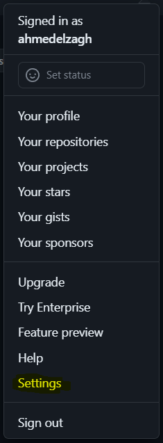
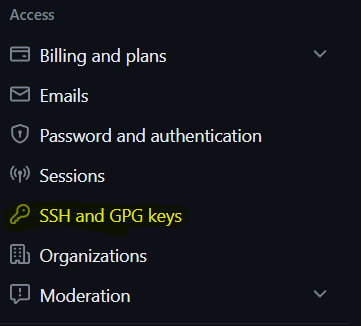
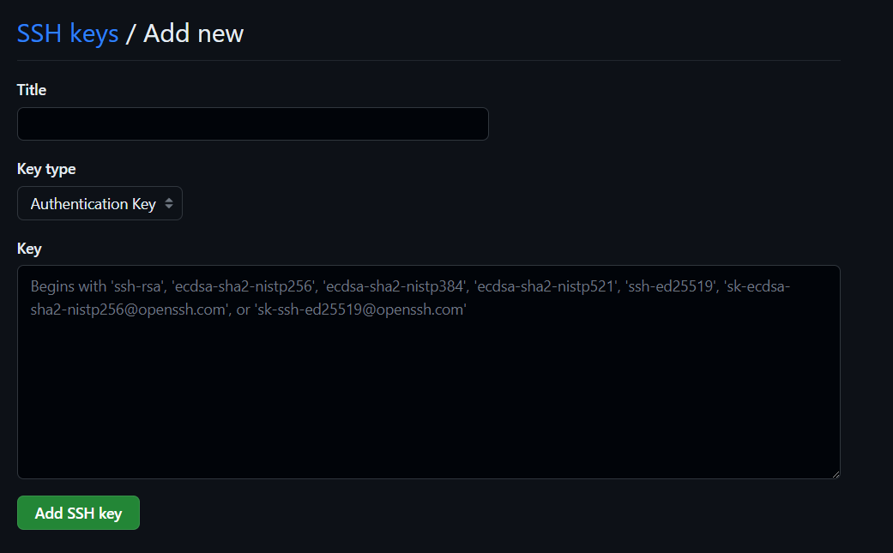

# Git

Git is a distributed version control system (VCS) widely used for tracking changes in source code during software development. It provides an efficient, fast, and flexible way to manage code and collaborate on projects.
For more detailed information and usage instructions, refer to the official [Git documentation](https://git-scm.com/doc).

## Features:
- **Distributed**
	Git is a distributed version control system, which means that each developer has a complete copy of the entire repository, including its history. This allows for offline work and seamless collaboration without relying on a central server.
- **Snapshots**
	Git uses a "snapshot-based" approach to version control. Instead of storing differences between versions, it captures the entire state of the project at each commit. This makes branching and merging fast and efficient.
- **Branching and Merging**
	Git makes it easy to create branches, switch between them, and merge changes back into the main branch. Branching allows for parallel development, experimentation, and isolation of features or bug fixes.
- **History and Tracking**
	Git maintains a complete history of all commits made to a repository, enabling developers to track changes over time, understand who made specific changes, and revert to previous versions if needed.
- **Collaboration**
	Git provides mechanisms for collaborating with others, such as remote repositories and pull requests. Developers can push and pull changes to and from remote repositories, facilitating teamwork and code sharing.
- **Staging Area**
	Git has a staging area (also called the index) where changes can be selectively prepared for commit. This allows developers to review and organize changes before committing them.

## Usage:
Git is widely used in various software development workflows, including open-source projects, enterprise software development, and individual projects. It is supported on multiple operating systems and has a vast ecosystem of tools and services built around it, making it highly versatile and adaptable to different development environments.

## Using GitHub on a New Machine:
1. Create an [**SSH key**](./SSH)
2. Display and copy your **public SSH key**:
	```bash
	cat .ssh/id_ed25519.pub
	```
3. Add the **public SSH key** to your **GitHub** account by going to `settings > SSH and GPG keys`, then pressing on `New SSH key` button and give a title to your **SSH key** and press `Add SSH key` after pasting your key:
	
	
	
4. Telling **Git** who we are by running the following commands:
```bash
git config --global user.name "Ahmed Elzagh"
git config --global user.email "contact@aelzagh.com"
```
*Note: That can be found later at `~/.gitconfig`.*

## Creating a local repository and pushing it to a remote repository:

```bash
git init #initializing a local repo
git add "file" #adding files to the staging area
git commit -m "your commit" #commiting changes
git branch -M main #forcefully rename the branch to main
git remote add origin repolink.git #associate the local repo with the remote
git push -u origin main #pushing local repo to remote
```

## Git Commands:

| Command                                               | Desc                                                                                                                                                                                                                                                                             |
| ----------------------------------------------------- | -------------------------------------------------------------------------------------------------------------------------------------------------------------------------------------------------------------------------------------------------------------------------------- |
| `git init`                                            | initializes a local repo.                                                                                                                                                                                                                                                        |
| `git add`                                             | adds a change in the working directory to the staging area.                                                                                                                                                                                                                      |
| `git commit -m "initial commit"`                      | commit changes, `-m` is used for allowing you to specify a commit message directly on the command line.                                                                                                                                                                          |
| `git commit -am "your commit"`                        | adds all changes and commit them at the same time. *note: Files in which changes happened must be added to the version control before*                                                                                                                                                                                                                                                                                 |
| `git branch -m main`                                  | renaming the current branch forcefully.                                                                                                                                                                                                                                          |
| `git remote add origing repoLink.git`                 | associate a remote repository with the name "origin" to your local repository. This allows you to push and pull changes between your local and the remote repositories.                                                                                                          |
| `git push -u origin main`                             | pushes local repo to remote, `-u` or `--set-upstream` flag is used to set the upstream branch. It tells Git to associate the local branch with the remote branch, enabling you to use `git push` or `git pull` without specifying the remote branch and local branch every time. |
| `git status`                                          | display the current state of local Git repository (Branch information, Staging area, Untracked files, Upstream information).                                                                                                                                                     |
| `git diff`                                            | Shows the differences between the working directory and the previous commit for all modified files.                                                                                                                                                                              |
| `git diff --staged`                                   | Shows the differences between the staged changes and the previous commit.                                                                                                                                                                                                        |
| `git diff file.txt`                                   | Shows the differences for a specific file.                                                                                                                                                                                                                                       |
| `git diff directory/`                                 | Shows the differences for all files in a specific directory.                                                                                                                                                                                                                     |
| `git log --oneline`                                   | display commits that have been made to the repo, `--oneline` is used to consolidate them to one line each.                                                                                                                                                                       |
| `git revert hash`                                     | revert a particular commit and prompts you to add a message, add the hash number of the commit you want to revert.                                                                                                                                                               |
| `git clone repo.git`                                  | clones a remote repo to local machine.                                                                                                                                                                                                                                           |
| `git branch`                                          | display available branches.                                                                                                                                                                                                                                                      |
| `git fetch`                                           | fetch a remote branch.                                                                                                                                                                                                                                                           |
| `git checkout branch-name`                            | switches branch, if the destination branch doesn't exist you have to append the `-b` option.                                                                                                                                                                                     |
| `git checkout commit-hash` or `git checkout tag-name` | checks out a specific commit or tag.                                                                                                                                                                                                                                             |
| `git checkout -- .` or `git checkout -- <file>`       | discards local changes in the current branch.                                                                                                                                                                                                                                    |
| `git checkout -t <remote_name>/<branch_name>`         | switches to a remote branch, `-t` option stands for `track` and it is used to create the branch and setting up the upstream branch automatically to the remote branch.                                                                                                           |
| `git switch branch-name`                              | switches branch, if the destination branch doesn't exist you have to append the `-c` option.                                                                                                                                                                                     |
| `git switch --discard-changes`                        | discards local changes in the current branch.                                                                                                                                                                                                                                    |
| `git switch -- <file>`                                | restores the state of a specific file to match the branch.                                                                                                                                                                                                                       |
